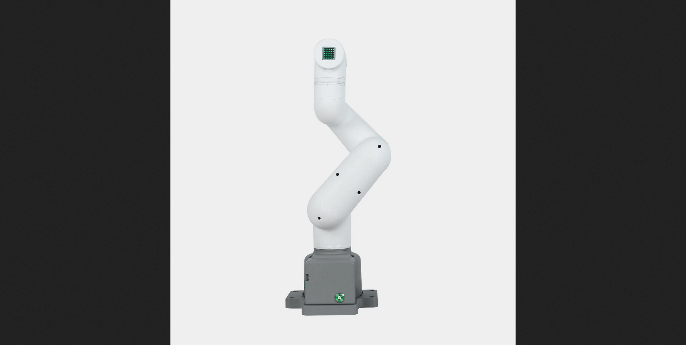

# Mycobot 280 ROS2 #


<br>

## Why?
With this project I expect to get a deeper understanding of the following concepts: <br>
- Get familiar with simulations inside ROS2 ecosystem:
  - Rviz2, Gazebo, Moveit2
- Get a grasp of basic robotics concepts like motion planning
- Implement and get familiar with using linear algebra concepts applied to robots:
  - Applied linear algebra
  - Geometry foundations
  - Reference frames and transformations
  - Forward kinematics
  - Inverted kinematics
  - Jacobian and differential kinematics
  - Trajectories and motion planning
- Develop a deeper understanding on how to use Clion to work on docker containers with ros2 images


All the development environment will run inside a docker container running the [jazzy-desktop-full](https://discourse.openrobotics.org/t/ros-jazzy-docker-images/37879). This allows for flexibility using different flavors of ROS inside my machine (which by the way is not compatible with Jazzy, I'm still running Ubuntu 22), and also it allows for other developers, makers and curious people to run the project locally smoothly. <br>

#### Instructions
Inside the docker folder you will find the Dockerfile, just run the command ```docker build -t mycobot280-jazzy-dev .``` inside to generate an image. After that just running ```./startcontainer.sh``` should start the container, please **read the instructions inside the script**. In case it is not compatible with your system just run the raw command to start a container present inside the script. <br>
The other script ```env.sh``` is to print the environment variables that ROS needs to work, I need that because I'm working on Clion and it won't work without the env variables and the root ```CMakeLists.txt```. So if you're not using Clion you can probably ignore those. Shoutout to [piraka9011](https://github.com/piraka9011) for the script and [instructions](https://www.allaban.me/posts/2020/08/ros2-setup-ide-docker/)